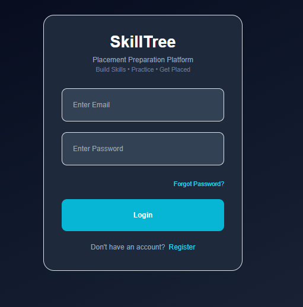
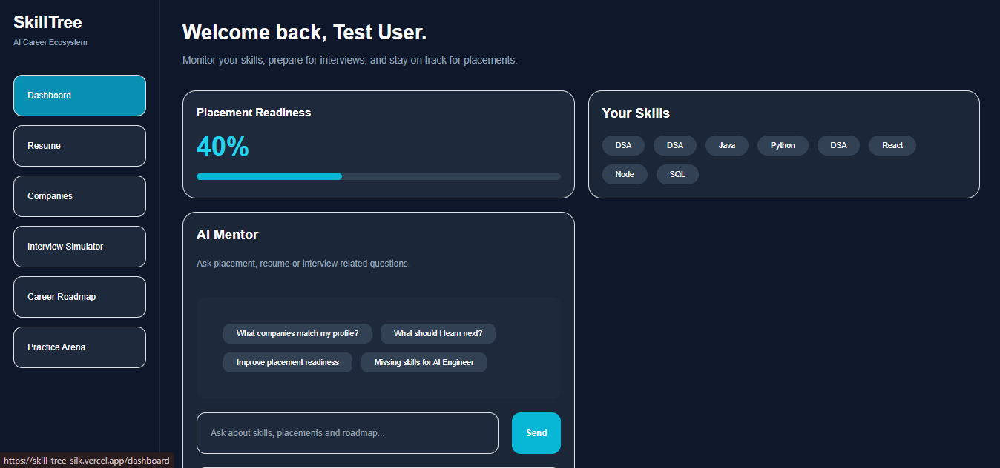
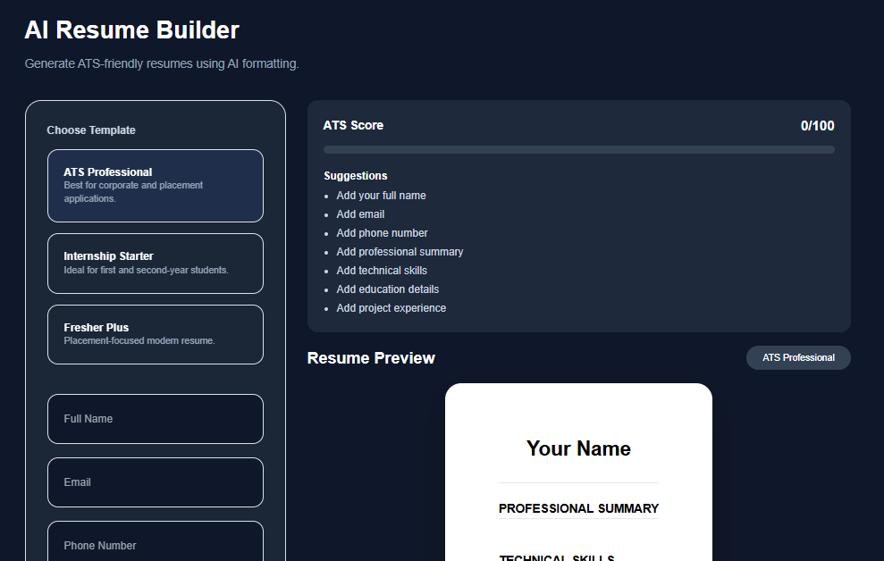
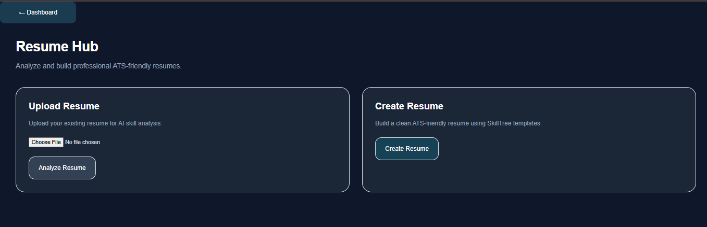
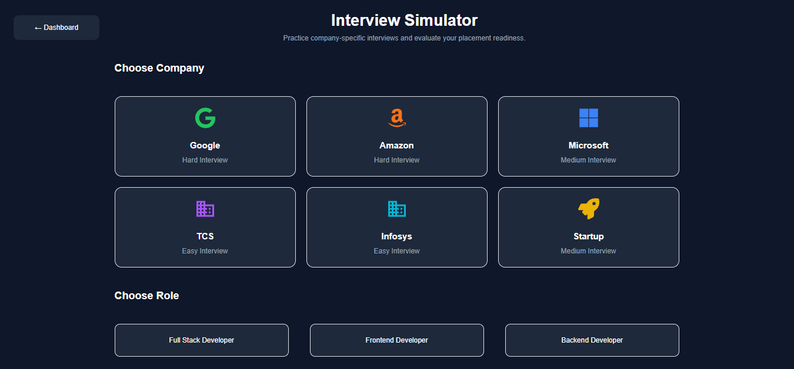
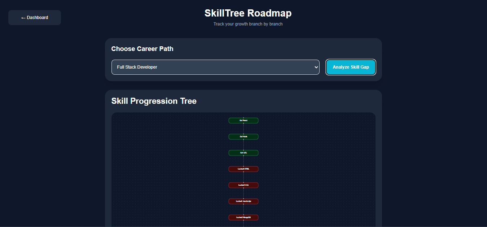
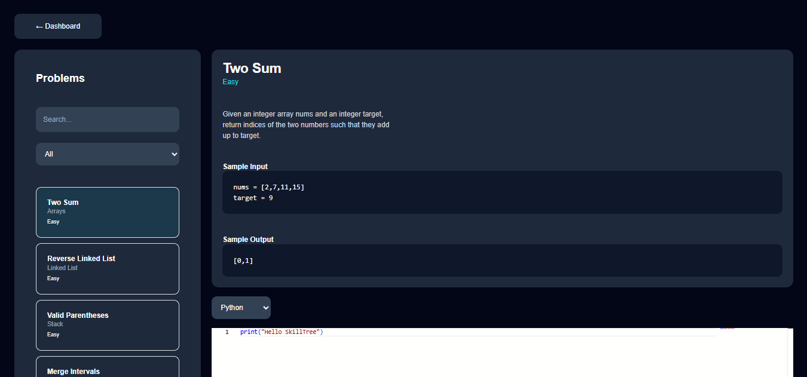

#  SkillTree

A full-stack placement preparation platform that helps students track their skills, analyze resumes, discover career roadmaps, practice interviews, and evaluate company readiness—all in one place.

> Built to simplify placement preparation by bringing multiple tools into a single platform.

---

##  Live Demo

### Frontend
https://skill-tree-silk.vercel.app/

### Backend API
https://skilltree-api-cwjk.onrender.com/

---

##  Preview
### Login Page



---

### Dashboard



---

### Resume Builder



---

### Resume Analyzer



---

### Company Recommendation Engine



---

### Career Roadmaps



---

### Interview Simulator



---

#  Features

###  Authentication
- Secure Login & Registration
- JWT Authentication
- Password Reset

###  Resume Builder
- Multiple Resume Templates
- ATS-Friendly Layouts
- PDF Export

###  Resume Analyzer
- Upload Resume
- Automatic Skill Extraction
- Skill Storage

### Placement Readiness
- Readiness Score
- Visual Progress Bar
- Skill Tracking

###  Company Recommendation Engine
- Company Eligibility Check
- Missing Skills Detection
- Personalized AI Insights

###  Career Roadmaps
- Frontend Developer
- Backend Developer
- Full Stack Developer
- AI/ML Engineer
- DevOps Engineer

###  AI Mentor
- Placement Guidance
- Resume Tips
- Interview Assistance

### Interview Simulator
- Company-Based Questions
- Performance Report
- Progress Tracking

### Coding Practice Arena 
- Problems based on difficulty levels
- Clues and Discusssions *(Coming Soon)*
---

# 🛠 Tech Stack

## Frontend

- React.js
- Tailwind CSS
- Axios
- React Router
- React Hot Toast

## Backend

- Node.js
- Express.js
- JWT Authentication
- bcrypt.js

## Database

- MySQL (Railway)

## Deployment

- Vercel (Frontend)
- Render (Backend)
- Railway (Database)

---

# 📂 Project Structure

```
SkillTree
│
├── client
│   ├── components
│   ├── pages
│   ├── services
│   └── assets
│
├── server
│   ├── controllers
│   ├── routes
│   ├── config
│   ├── middleware
│   └── app.js
│
└── README.md
```

---

# ⚙ Installation

Clone the repository

```bash
git clone https://github.com/MoNiMoNiSh18/SkillTree.git
```

Move into the project

```bash
cd SkillTree
```

### Install Frontend

```bash
cd client
npm install
npm start
```

### Install Backend

```bash
cd server
npm install
npm start
```

---

# 🔐 Environment Variables

Backend (.env)

```env
PORT=5000

DB_HOST=hayabusa.proxy.rlwy.net:24444

DB_PORT=24444

DB_NAME=placement_db

DB_USER=root

DB_PASS=PTMcKzQDytnaQqHMZHoRnSmXfENGsCKp

JWT_SECRET=skilltree_secret
```

Frontend (.env)

```env
REACT_APP_API=https://skill-tree-silk.vercel.app/
```

---

# 🚀 Future Improvements

- AI Resume Feedback
- AI Career Mentor
- Online Code Execution
- Resume Intelligence
- Placement Analytics Dashboard
- Company-Specific Interview Database
- Webcam-Based Interview Proctoring
- Mock Interview Evaluation
- Coding Contest Platform

---

# 👨‍💻 Author

**Monish V**

B.E. Computer Science & Engineering

Acharya Institute of Technology

### GitHub

https://github.com/MoNiMoNiSh18

### LinkedIn

https://www.linkedin.com/in/monish-v-1820j06/

---

# Support

If you found this project useful, consider giving it a ⭐ on GitHub.

It motivates me to build more open-source projects.

---

## License

This project is licensed under the MIT License.